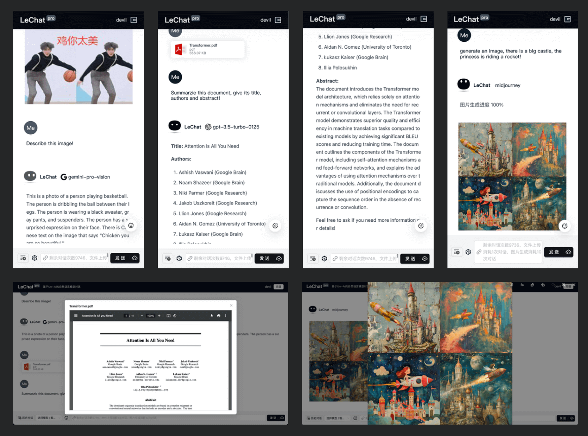

<p align="center"></p>

<h1 align="center">UniAI</h1>

<h3 align="center">统一 AI 模型！</h3>

<p align="center">🤗 我们不生产模型，我们只是模型的搬运工！</p>

<!--  -->

<h3 align=center>聊天</h3>


<h3 align=center>生图</h3>

<table>
    <tr>
        <td colspan="3"><strong>Prompt:</strong> Pink dress, Candy, Sandy, Mandy, short hair, blonde hair, bangs, forehead, red lipstick, elbow gloves, hair accessories, high heels, sitting, cross legged, high chair, cocktail, holding cocktail glass, looking through the glass.</td>
    </tr>
    <tr>
        <td colspan="3"><strong>Negative Prompt:</strong> EasyNegative, badhandv4, badv5, aid210, aid291.</td>
    </tr>
    <tr>
        <td width="33.3%"><strong>MidJourney</strong></td>
        <td width="33.3%"><strong>Stability v1.6</strong></td>
        <td width="33.3%"><strong>OpenAI DALL-E-3</strong></td>
    </tr>
    <tr>
        <td width="33.3%"></td>
        <td width="33.3%"></td>
        <td width="33.3%"></td>
    </tr>
</table>

<h3 align=center>写法</h3>

```typescript
import UniAI from 'uniai'
// 初始化一个UniAI对象，传入需要用的模型的key和proxy
const ai = new UniAI({ OpenAI: { key: 'Your key', proxy: 'Your proxy API' } })
// 使用聊天功能
const chat = await ai.chat('hello world')
// 使用表征向量功能
const embedding = await ai.embedding('hello world')
// 使用生图功能（异步，需等待，见下方task）
const task = await ai.imagine('a panda is eating bamboo')
// 列出生图的任务列表
const image = await ai.task(task.taskId)
// 修改某个图片，仅支持Midjourney模型，返回新任务id
const task2 = await ai.change('midjourney', task.taskId, 'UPSCALE', 4)
```

[🇺🇸 🇬🇧 English Readme](./README.md) · 中文

## 已支持模型

<p align="left">


</p>

-   [科大讯飞/星火大模型](https://xinghuo.xfyun.cn)
-   [清华大学/ChatGLM-6B](https://github.com/THUDM/ChatGLM4)
-   [智谱/GLM](https://open.bigmodel.cn)
-   [OpenAI/GPT](https://platform.openai.com)
-   [百度/文心千帆大模型](https://cloud.baidu.com/product/wenxinworkshop)
-   [Google/Gemini](https://makersuite.google.com/app/)
-   [月之暗面/moonshot](https://platform.moonshot.cn/docs)
-   [OpenAI/DALL-E](https://platform.openai.com)
-   [MidJourney](https://github.com/novicezk/midjourney-proxy)
-   [Stability AI](https://platform.stability.ai/docs/getting-started)
-   [Stable Diffusion](https://github.com/AUTOMATIC1111/stable-diffusion-webui)
-   [GanymedeNil/text2vec-large-chinese](https://huggingface.co/GanymedeNil/text2vec-large-chinese)

## 体验应用

我们使用 **uniai** 开发了一些App作为示范，欢迎体验和打赏支持我们：

<div align=center>


<br>

</div>

## 安装

**使用 yarn：**

```bash
yarn add uniai
```

**使用 npm：**

```bash
npm install uniai
```

## 示例

> 我们为编写了简单的调用demo，放置在`/examples`文件夹中，您可以直接阅读`/examples/chat.js`文件来了解如何使用UniAI。
> 您也可以继续往下阅读，依据文档，来了解如何使用UniAI。

### 列出支持的模型

您可以使用 `.models` 来列出 UniAI 中所有可用的模型。

**使用 TypeScript 和 JavaScript ES6+**

```typescript
import UniAI from 'uniai'

const ai = new UniAI()
console.log(ai.models)
```

**使用 JavaScript ES5**

```javascript
const UniAI = require('uniai').default
const ai = new UniAI()
console.log(ai.models)
```

**输出**

```json
[
    {
        "provider": "OpenAI",
        "value": "openai",
        "models": [
            "gpt-3.5-turbo-1106",
            "gpt-3.5-turbo",
            "gpt-3.5-turbo-16k",
            "gpt-4",
            "gpt-4-32k",
            "gpt-4-1106-preview",
            "gpt-4-vision-preview"
        ]
    },
    {
        "provider": "Google",
        "value": "google",
        "models": ["gemini-pro", "gemini-pro-vision", "gemini-ultra"]
    },
    // 其他提供商的模型也在此列出
    {
        "provider": "Other",
        "value": "other",
        "models": []
    }
]
```

### 模型聊天

要与模型交互，请使用 `.chat()`，并在初始化 `new UniAI()` 时记得提供所需的 API 密钥或代理参数。

默认模型是 OpenAI/gpt-3.5-turbo，请提供 OpenAI 密钥和代理 API。

```typescript
const key: string | string[] = '您的 OpenAI 密钥（必填），已支持多key轮询'
const proxy = '您的 OpenAI API 代理（可选）'
const uni = new UniAI({ OpenAI: { key, proxy } })
const res = await uni.chat()
console.log(res)
```

**输出**

```json
{
    "content": "我是 OpenAI 的语言模型，训练有素，可以帮助提供信息。",
    "model": "gpt-3.5-turbo-0613",
    "object": "chat.completion",
    "promptTokens": 20,
    "completionTokens": 13,
    "totalTokens": 33
}
```

**带图聊天**

```js
const input = [
    {
        role: 'user',
        content: '描述下这张图片，是个男人还是女人，她在做什么？',
        img: 'https://pics7.baidu.com/feed/1f178a82b9014a903fcc22f1e98d931fb11bee90.jpeg@f_auto?token=d5a33ea74668787d60d6f61c7b8f9ca2'
    }
]
const res = await ai.chat(input, { model: 'gpt-4-vision-preview' })
console.log(res)
```

**输出**

```json
{
    "content": "这张图片展示了一位女性，她正站在镜子前用手机自拍。她穿着一件带有蓝色边缘和装饰的黑色及膝服装...",
    "model": "gpt-4-1106-vision-preview",
    "object": "chat.completion",
    "promptTokens": 456,
    "completionTokens": 204,
    "totalTokens": 660
}
```

### 流式聊天

对于流式聊天，响应是一个 JSON Buffer。

以下是与 Google gemini-pro 进行流式聊天的示例。

```typescript
const key: string | string[] = '您的 Google 密钥（必填），已支持多key轮询'
const proxy = '您的 Google API 代理（可选）'
const uni = new UniAI({ Google: { key, proxy } })
const res = await uni.chat(input, { stream: true, provider: ModelProvider.Google, model: GoogleChatModel.GEM_PRO })
const stream = res as Readable
let data = ''
stream.on('data', chunk => (data += JSON.parse(chunk.toString()).content))
stream.on('end', () => console.log(data))
```

**输出**

```
Google 训练的语言模型，为您提供服务。
```
可自行添加包围：`data: {string}\n\n`，可实现`SSE`给前端

## 运行测试

UniAI 使用 `test` 来运行所有模型的单元测试。

```bash
yarn test
```

如果要运行特定模型提供商的单元测试：

```bash
# OpenAI、Google、Baidu、IFlyTek、MoonShot、GLM、Other, Imagine...
yarn test OpenAI
```

## 贡献者

[Youwei Huang](https://github.com/devilyouwei)

[Weilong Yu](https://github.com/mrkk1)

huangyw@iict.ac.cn

## 有谁在使用

|                          项目                           |                              简介                               |
| :-----------------------------------------------------: | :-------------------------------------------------------------: |
|   [UniAI MaaS](https://github.com/uni-openai/UniAI/)    | UniAI 是一个统一的 API 平台，旨在简化与多种复杂 AI 模型的交互。 |
| [乐聊小程序](https://github.com/CAS-IICT/lechat-uniapp) |           基于大语言模型的文档分析，对话微信小程序。            |
|        [LeChat Pro](https://lechat.cas-ll.cn/#/)        |          基于UniAI的全平台客户端，多模型流式对话平台。          |

## Star

[](https://star-history.com/#devilyouwei/UniAI&Timeline)

## License

[MIT](./LICENSE)

Copyright (c) 2022-present, Youwei Huang
